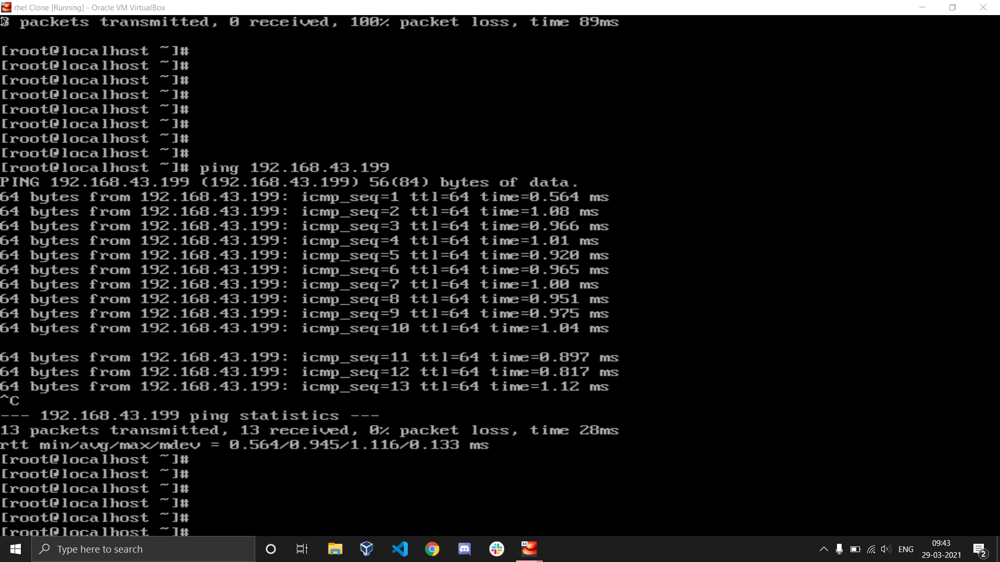

# Network Architecture 

## Project Description 

In this project we create a network architecture of 3 systems such that system A can ping to both B and C and vice versa but B and C cannot ping each other. 
The three systems are three VM's launched using oracle virtualbox. All the vm's are connected to a single switch and are in the same network range or we can say that they have the same network name. 
The three systems have ip's as follow:
1. System A: 192.168.43.166
2. System B: 192.168.43.199
3. Ststem C: 192.168.43.186

### Target Points:
1. A should be able to ping to both B and C 
2. B and C should be able to ping A
3. B and C should not be able to ping each other

### Graphical 


## Theory 

By default every system has a number of routes which it uses to connect to different ip's. 

To list the available routes
```bash
route -n
```

To connect/send network packets to the vm's in the same netowrk range the system uses the swtich.
For the vm to connect to ip's out of the network range a router or gateway is used. If there is no router the vm will be unable to connect to internet. 

### Routes of system A:


Here to the range of ip's that the system A can connect without router ie. range of ip's in the same range are 192.168.43.0/24 or 192.168.43.0-255. 

The route 0.0.0.0 and netmak 0.0.0.0 is used to connect to any ip range using the gateway 192.168.43.1 which is the ip of router. 

## Steps

To achieve the desired network architecture we delete some rotutes and create new ones. We also use concept of subnetting. 

### System A
In the system A we delete the route 0.0.0.0/0 to block the internet connection. 

To delete the 0.0.0.0/0 route:
```bash
route del -net 0.0.0.0  netmask 0.0.0.0  enp0s3
```


Now we try pinging to B and C 

```bash 
ping 192.168.43.186

ping 192.168.43.199
```

### Result



System A is able to ping to both B and C using the 192.168.43.0/24 route. So target point 1 is satisfied.

### System B
Initially system B is able to ping to both system A and C. We want to block the connection to system C. 


We start by deleting both the 0.0.0.0/0  and 192.168.43.0/24 routes.
```bash
route del -net 0.0.0.0  netmask 0.0.0.0 enp0s3

route del -net 192.168.43.0  netmask 255.255.255.0 enp0s3
```
This makes both system A and system C unreachable. 

So we create a new route in system B which will make system A accessible, the route is 192.168.43.166/32.

To add this route:
```bash 
route add -net 192.168.43.166  netmask 255.255.255.255  enp0s3
```

Now if we try to ping system A it is pingable but system C is still unreachable. 


So system B fits the requirement. 

## System C
We repeat same steps with system C to block connection with system B but allow system A.


Thus we can see that system C is not able to ping to system B but is reaching system A. 

Hence, all the target points are fulfilled. 
